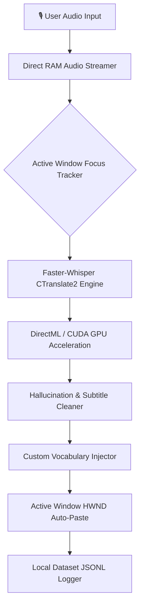

# 🎙️ Whisper Voice Dictation AI (Offline Speech-to-Text Widget)

<p align="center">
  
  
  
  
  
  
  
</p>

<p align="center">
  <b>[ 🇺🇸 English ](README.md) | [ 🇷🇺 Русский ](README_RU.md)</b>
</p>

<p align="center">
  <b>Ultra-fast, 100% offline, privacy-first AI voice dictation widget for Windows. Powered by OpenAI Whisper Turbo, DirectML / CUDA GPU acceleration, zero-latency RAM streaming, intelligent active-window auto-paste, and background tray isolation.</b>
</p>

---

## 🌟 Why Whisper Voice Dictation AI?

| Feature | 🎙️ Whisper Voice AI | ☁️ Cloud APIs (OpenAI / Google) | 🪟 Windows Dictation (Win+H) | 🍎 MacWhisper / Superwhisper |
| :--- | :---: | :---: | :---: | :---: |
| **Privacy & Offline** | 🔒 **100% Local / Air-gapped** | ❌ Voice sent to cloud servers | ❌ Requires Microsoft Cloud | ⚠️ macOS Only |
| **Response Latency** | ⚡ **~0.25s (Ultra-fast Turbo)** | 🐢 1.5s - 3.5s (Network lag) | 🐢 Noticeable delay | ⚡ ~0.5s |
| **GPU Acceleration** | 🚀 **AMD DirectML + NVIDIA CUDA** | ❌ Server-dependent | ❌ None | 🍏 Apple Silicon Only |
| **Auto-Paste Target** | 🎯 **Active Window HWND Tracker** | ❌ Manual clipboard paste | ⚠️ Unreliable focus | 🎯 macOS Accessibility |
| **Hallucination Cleaner** | 🛡️ **YouTube Subtitle Filter** | ❌ Raw phantom text | ❌ Misrecognitions | ❌ None |
| **Pricing & Limits** | 🆓 **100% Free & Open Source (MIT)**| 💰 Pay per minute / subscription | ⚠️ Tied to Windows account | 💰 $30-$120 / Paid licenses |

---

## 📥 Download Ready-to-Run Portable App (No Python Required)

Download the standalone portable executable and start dictating in 5 seconds!

| Platform | Download Link | Notes |
| :--- | :--- | :--- |
| **🪟 Windows (10 / 11 64-bit)** | 👉 **[Download `WhisperVoiceDictation.exe`](https://github.com/yurac777/whisper-voice-dictation-ai/releases/latest/download/WhisperVoiceDictation.exe)** | Portable `.exe` (all AI models self-contained) |
| **📦 GitHub Releases** | 👉 **[All Releases & Checksums](https://github.com/yurac777/whisper-voice-dictation-ai/releases)** | Source archives, fast build packages, and SHA256 hashes |

---

## 🚀 Key Features

- ⚡ **Zero-Disk RAM Streaming:** Audio streams directly from microphone buffers into Faster-Whisper memory without saving temporary WAV files to disk, achieving a record-breaking **~0.25s** turnaround latency.
- 🎮 **Hardware GPU Acceleration (AMD Radeon, NVIDIA, Intel):** Full support for **NVIDIA CUDA (float16)** with automatic fallback to **DirectML** and multi-threaded CPU int8 quantization.
- 🎯 **Intelligent Active-Window Auto-Paste:** Automatically tracks the foreground window (Telegram, Discord, VS Code, MS Word, Slack, Obsidian, Chrome) and injects recognized text into the active cursor position.
- 🛡️ **Phantom Subtitle & Hallucination Filter:** Specialized algorithmic sanitization (`clean_hallucinated_subtitles`) strips phantom YouTube captions (*"Subtitles by...", "Thanks for watching"*) if recording captures silence or background noise.
- ➖ **System Tray & Minimized Mode Security:** One-click minimize to tray (`➖`). When minimized, all global hotkeys and mouse clicks are automatically blocked to prevent accidental triggers while gaming or browsing.
- 🛡️ **Browser Tab Closing Protection:** Configurable middle-click delay threshold (120ms) prevents accidental dictation triggers when closing tabs in Chrome/Edge/Firefox.
- 🌍 **99+ Languages Supported:** Instant switching between English, Russian, German, French, Spanish, Chinese, Japanese, Ukrainian, Polish, Turkish, and auto-detection.
- 📁 **Local Fine-Tuning Dataset Logger:** Automatically archives `.wav` audio and recognized transcripts into structured `logs/recordings/` for local LLM/speech dataset curation.

---

## 🏗️ Architecture & Pipeline



---

## ⌨️ Default Hotkeys

| Shortcut | Action | Description |
| :--- | :--- | :--- |
| **Middle Click / R-Alt / R-Ctrl / F9 / F10** | **Start / Stop Dictation** | Configurable in Settings dialog |
| **`ESC`** | **Cancel Recording** | Discards current audio buffer and restores media playback |
| **`Pause / Break`** | **Convert Layout (EN ↔ RU)** | Fixes accidentally typed text in wrong keyboard layout |
| **Tray Double-Click** | **Restore / Hide Widget** | Quick toggle from Windows taskbar tray |

---

## 🛠️ Developer Quickstart

If you want to run from source or contribute:

```bash
# 1. Clone repository
git clone https://github.com/yurac777/whisper-voice-dictation-ai.git
cd whisper-voice-dictation-ai

# 2. Create virtual environment (Python 3.10 - 3.12)
python -m venv .venv
.venv\Scripts\activate

# 3. Install dependencies
pip install -r requirements.txt

# 4. Run application
python main.py
```

### CLI Command-Line Arguments

```bash
# Start directly minimized in system tray
python main.py --minimized

# Override default model size
python main.py --model turbo

# Override default language
python main.py --lang en

# Check application version
python main.py --version
```

---

## 📊 Performance Benchmarks

| Hardware | Model Size | Precision | Turnaround Latency | Real-Time Factor (RTF) |
|---|---|---|---|---|
| **NVIDIA RTX 4070 Laptop** | `turbo` | `float16 (CUDA)` | **~0.18s** | `0.03x` |
| **AMD Radeon 780M / 880M** | `turbo` | `float16 (DirectML)` | **~0.26s** | `0.05x` |
| **Intel Core i7-13700H (CPU)**| `turbo` | `int8 (4 threads)` | **~0.38s** | `0.08x` |
| **CPU Default (4 Threads)** | `small` | `int8` | **~0.22s** | `0.04x` |

---

## 🔒 Enterprise Privacy & Compliance

- **Zero Network Traffic:** The application does not contain telemetry, tracking, or cloud network calls. All inference runs strictly on the user's local machine.
- **GDPR & HIPAA Friendly:** Ideal for medical transcription, legal documentation, financial auditing, and confidential software development.
- **Air-Gapped Compatible:** Fully operational on isolated corporate networks without Internet connectivity.

---

## 🤝 Contributing & Community

Contributions are welcome! Please check out [CONTRIBUTING.md](CONTRIBUTING.md) and [SECURITY.md](SECURITY.md).

1. Fork the Project
2. Create your Feature Branch (`git checkout -b feat/AmazingFeature`)
3. Commit your Changes (`git commit -m 'feat: Add AmazingFeature'`)
4. Push to the Branch (`git push origin feat/AmazingFeature`)
5. Open a Pull Request

---

## 📄 License

Distributed under the **MIT License**. See [`LICENSE`](LICENSE) for more information.
