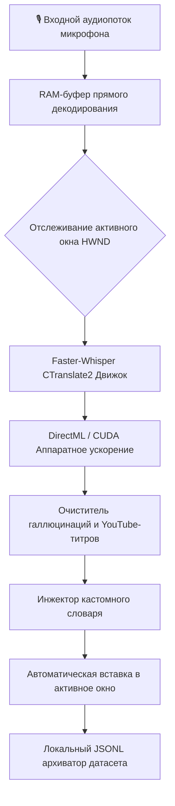

# 🎙️ Whisper Voice Dictation AI (Офлайн Голосовой Диктант)

<p align="center">
  
  
  
  
  
  
  
</p>

<p align="center">
  <b>[ 🇺🇸 English ](README.md) | [ 🇷🇺 Русский ](README_RU.md)</b>
</p>

<p align="center">
  <b>Ультрабыстрый, 100% локальный ИИ-виджет голосовой надиктовки текста для Windows. Работает на базе OpenAI Whisper Turbo, DirectML / CUDA GPU ускорения (AMD/NVIDIA/Intel), прямым декодированием в RAM, автовставкой текста в активное окно и изоляцией горячих клавиш в трее.</b>
</p>

---

## 🌟 Почему Whisper Voice Dictation AI?

| Возможность | 🎙️ Whisper Dictation AI | ☁️ Облачные сервисы (Яндекс/Whisper API) | 🪟 Встроенный ввод Windows (Win+H) | 🍎 MacWhisper / Superwhisper |
| :--- | :---: | :---: | :---: | :---: |
| **Приватность и Офлайн** | 🔒 **100% Локально и Офлайн** | ❌ Отправляет ваш голос на серверы | ❌ Требует облако Microsoft | ⚠️ Только macOS |
| **Скорость отклика** | ⚡ **~0.25 секунды (Turbo)** | 🐢 1.5 - 3.5 секунды (сетевая задержка) | 🐢 Заметные задержки | ⚡ ~0.5 сек |
| **GPU Ускорение** | 🚀 **AMD DirectML + NVIDIA CUDA** | ❌ Зависит от серверов | ❌ Нет | 🍏 Только Apple Silicon |
| **Автоматическая вставка** | 🎯 **Отслеживание фокуса HWND** | ❌ Только вручную через буфер | ⚠️ Сбои фокуса ввода | 🎯 macOS Accessibility |
| **Фильтр фантомных титров**| 🛡️ **YouTube Subtitle Filter** | ❌ Выдает посторонний мусор | ❌ Ошибки распознавания | ❌ Нет |
| **Цена и Лицензия** | 🆓 **100% Бесплатно (MIT)** | 💰 Платно за каждую минуту | ⚠️ Привязано к аккаунту | 💰 $30-$120 за лицензию |

---

## 📥 Скачать готовую программу (Не требует установки Python)

Скачайте портативный `.exe` файл и начните диктовать текст уже через 5 секунд!

| ОС Платформа | Ссылка на скачивание | Примечание |
| :--- | :--- | :--- |
| **🪟 Windows (10 / 11 64-bit)** | 👉 **[Скачать `WhisperVoiceDictation.exe`](https://github.com/yurac777/whisper-voice-dictation-ai/releases/latest/download/WhisperVoiceDictation.exe)** | Портативный `.exe` (все модели ИИ в комплекте) |
| **📦 Релизы и Контрольные суммы**| 👉 **[Все версии на GitHub Releases](https://github.com/yurac777/whisper-voice-dictation-ai/releases)** | Архивы исходного кода, быстрые сборки и SHA256 хеши |

---

## 🚀 Главные преимущества и фичи

- ⚡ **Передача аудио прямо в RAM памяти:** Звук из микрофона передаётся напрямую в нейросеть без записи временных файлов на жесткий диск, обеспечивая рекордную задержку в **~0.25 сек**!
- 🎮 **Аппаратное GPU-ускорение (AMD / NVIDIA / Intel):** Встроенная поддержка **NVIDIA CUDA (float16)** с автопереключением на **Microsoft DirectML** и многопоточный процессорный CPU int8 режим.
- 🎯 **Умное отслеживание фокуса окон:** Программа автоматически запоминает ваше рабочее приложение (Telegram, Word, браузер, VS Code, Discord, Obsidian) и вставляет текст точно в него, даже если вы кликаете по кнопке мышкой!
- 🛡️ **Фильтр фантомных субтитров:** Алгоритм `clean_hallucinated_subtitles` мгновенно вычищает титры из YouTube (вроде *«Субтитры создавал...»*, *«Редактор...»*, *«Спасибо за просмотр»*), если вы молчали при записи.
- ➖ **Свертывание в системный трей и безопасность ввода:** Кнопка `➖` сворачивает панель в трей. В свернутом режиме **все горячие клавиши и клики мыши автоматически блокируются**, исключая случайные записи во время игр или сёрфинга.
- 🌐 **Защита вкладок браузера:** Настраиваемая задержка клика колесика (120 мс) защищает от случайного включения записи при быстром закрытии вкладок.
- 🌍 **99+ языков:** Мгновенное переключение между русским, английским, немецким, французским, испанским, китайским и автоопределением.
- 📁 **Локальный датасет для дообучения:** Автоматическое сохранение аудиофайлов `.wav` и распознанных текстов в папку `logs/recordings/` для создания персональных датасетов.

---

## 🏗️ Архитектура и пайплайн работы



---

## ⌨️ Горячие клавиши

| Сочетание | Действие | Описание |
| :--- | :--- | :--- |
| **Клик колесиком / R-Alt / R-Ctrl / F9 / F10** | **Старт / Стоп надиктовки** | Настраивается в окне настроек `⚙️` |
| **`ESC`** | **Отменить запись** | Очищает буфер звука и возвращает воспроизведение музыки |
| **`Pause / Break`** | **Смена раскладки (RU ↔ EN)** | Исправляет текст, набранный не в той раскладке клавиатуры |
| **Двойной клик по иконке в трее** | **Показать / Скрыть панель** | Быстрое разворачивание виджета |

---

## 🛠️ Запуск из исходного кода для разработчиков

```bash
# 1. Клонировать репозиторий
git clone https://github.com/yurac777/whisper-voice-dictation-ai.git
cd whisper-voice-dictation-ai

# 2. Создать виртуальное окружение (Python 3.10 - 3.12)
python -m venv .venv
.venv\Scripts\activate

# 3. Установить зависимости
pip install -r requirements.txt

# 4. Запустить приложение
python main.py
```

### Параметры командной строки (CLI)

```bash
# Запустить сразу свернутым в системный трей
python main.py --minimized

# Задать используемую модель Whisper
python main.py --model turbo

# Переопределить язык распознавания
python main.py --lang ru

# Проверить версию приложения
python main.py --version
```

---

## 📊 Замеры производительности (Бенчмарки)

| Оборудование | Модель | Режим точности | Время распознавания | Коэффициент Real-Time (RTF) |
|---|---|---|---|---|
| **NVIDIA RTX 4070 Laptop** | `turbo` | `float16 (CUDA)` | **~0.18 сек** | `0.03x` |
| **AMD Radeon 780M / 880M** | `turbo` | `float16 (DirectML)` | **~0.26 сек** | `0.05x` |
| **Intel Core i7-13700H (CPU)**| `turbo` | `int8 (4 потока)` | **~0.38 сек** | `0.08x` |
| **CPU Default (4 потока)** | `small` | `int8` | **~0.22 сек** | `0.04x` |

---

## 🔒 Безопасность и соответствие корпоративным стандартам

- **Полное отсутствие телеметрии:** Приложение не отправляет сетевых запросов и работает автономно в изолированных (Air-Gapped) средах.
- **Безопасность для юристов, медиков и финансов:** Конфиденциальные данные и голос не покидают операционную систему.

---

## 📄 Лицензия

Распространяется по свободной лицензии **MIT License**. Подробнее в файле [`LICENSE`](LICENSE).
